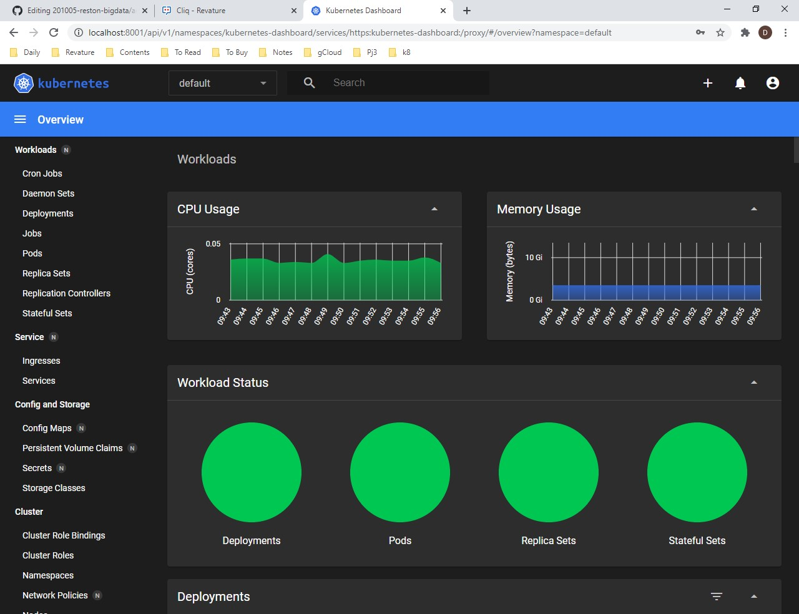

## AWS EKS 
Amazon Elastic Kubernetes Service (Amazon EKS) gives you the flexibility to start, run, and scale Kubernetes applications in the AWS cloud or on-premises. Amazon EKS helps you provide highly-available and secure clusters and automates key tasks such as patching, node provisioning, and updates. [from [AWS EKS](https://aws.amazon.com/eks/?whats-new-cards.sort-by=item.additionalFields.postDateTime&whats-new-cards.sort-order=desc&eks-blogs.sort-by=item.additionalFields.createdDate&eks-blogs.sort-order=desc)]

## Identity related commands
// show who you are at the moment
```
aws sts get-caller-identity
```

// show configuration for a specific profile
```
aws configure list --profile p3
```

// if you have other AWS accounts on your computer
// change 'p3' to your different profiles.
```
export AWS_PROFILE=p3
```

// see the different profiles on your computer
// show the config files in your ~ dir
```
cat ~/.aws/credentials
cat ~/.aws/config
```


## AWS CLI commands
Reference: [AWS CLI: Official command reference](https://docs.aws.amazon.com/cli/latest/index.html)

// show your aws-cli version
```
aws --version
```

// This command doesnt work for me - error 'NoneType' object is not iterable
// update: solved.  moved ~/.kube/config to ~/.kube/config.old.
```
aws eks --region us-east-1 update-kubeconfig --name adam-king-848
```
 
// show cluster metadata (`--name` references cluster, not user)
```
aws eks describe-cluster --name adam-king-848
```


## kubectl commands 
Reference: [AWS kubectl: Official command reference](https://kubernetes.io/docs/reference/generated/kubectl/kubectl-commands)
- [Another list, nicely organized into one page.](https://www.tutorialspoint.com/kubernetes/kubernetes_kubectl_commands.htm)

[AWS Install guide](https://docs.aws.amazon.com/eks/latest/userguide/install-kubectl.html)

// show client version
```
kubectl version --short --client
```

// shows urls of cluster master, coreDNS and metrics-server
```
kubectl cluster-info
```

// debugging info dump
```
kubectl cluster-info dump
```

// Shows yaml file with config info
```
kubectl config view
```

## EKS commands
Reference: [AWS EKS: Official command reference](https://docs.aws.amazon.com/cli/latest/reference/eks/index.html)

A list from the cli:
```
create-cluster                           | create-fargate-profile
create-nodegroup                         | delete-cluster
delete-fargate-profile                   | delete-nodegroup
describe-cluster                         | describe-fargate-profile
describe-nodegroup                       | describe-update
list-clusters                            | list-fargate-profiles
list-nodegroups                          | list-tags-for-resource
list-updates                             | tag-resource
untag-resource                           | update-cluster-config
update-cluster-version                   | update-nodegroup-config
update-nodegroup-version                 | update-kubeconfig
get-token                                | wait
help
```

###  AWS S3 commands
[AWS S3: Official command reference](https://docs.aws.amazon.com/cli/latest/reference/s3/index.html)

|Command|Functionality|
|--|--
| cp | copy lcl/S3 object to another location lcl or on S3
| ls | list S3 objects and common prefixes
| mb | creates and s3 bucket
| mv|  moves a local bucket
| rb| removes an empty bucket
| rm| delete s3 object

// list files in s3 
```
aws s3 --profile p3 ls s3://adam-king-848
```

### K8 Admin Dashboard

1. run your proxy (if you change your proxy port from the default, make sure to change the port in step 2.)
2. navigate to http://localhost:8001/api/v1/namespaces/kubernetes-dashboard/services/https:kubernetes-dashboard:/proxy/
3. get your access token (you must have updated your kubeconfig, and got verification your context was updated):
```
kubectl -n kubernetes-dashboard describe secret $(kubectl -n kubernetes-dashboard get secret | sls admin-user | ForEach-Object { $_ -Split '\s+' } | Select -First 1)
```

Screenshot:



---

### Interesting `kubectl get <name/shortname>` commands:
<pre>
NAME                              SHORTNAMES          APIGROUP                       NAMESPACED   KIND
componentstatuses                 cs                                                 false        ComponentStatus
nodes                             no                                                 false        Node
persistentvolumeclaims            pvc                                                true         PersistentVolumeClaim
persistentvolumes                 pv                                                 false        PersistentVolume
pods                              po                                                 true         Pod
services                          svc                                                true         Service
daemonsets                        ds                  apps                           true         DaemonSet
deployments                       deploy              apps                           true         Deployment
replicasets                       rs                  apps                           true         ReplicaSet
statefulsets                      sts                 apps                           true         StatefulSet
cronjobs                          cj                  batch                          true         CronJob
jobs                                                  batch                          true         Job
nodes                                                 metrics.k8s.io                 false        NodeMetrics
pods                                                  metrics.k8s.io                 true         PodMetrics
sparkapplications                 sparkapp            sparkoperator.k8s.io           true         SparkApplication
</pre>
