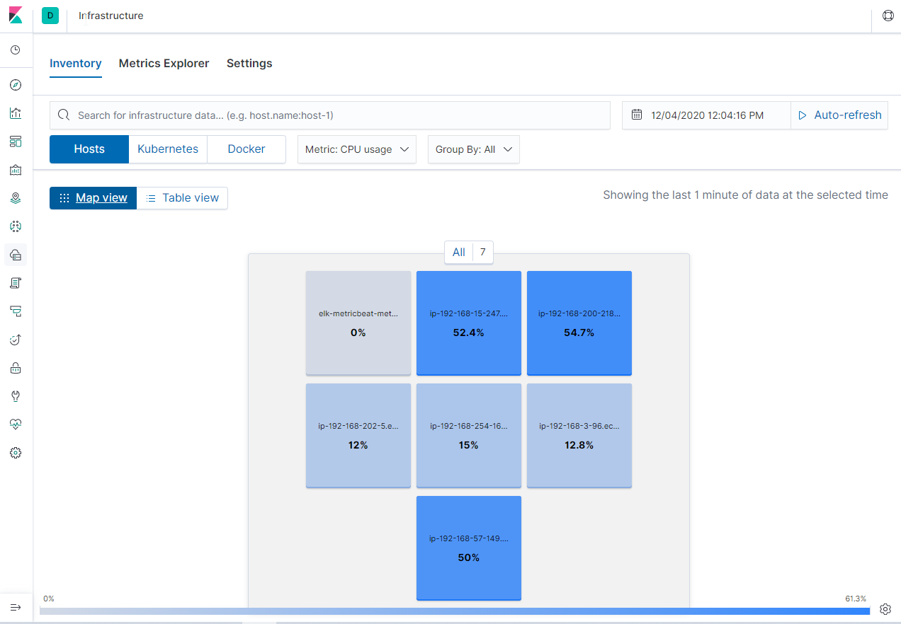
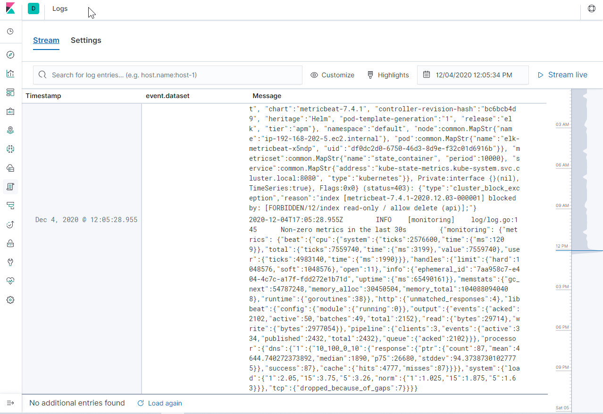

## The Kibana Dashboard

1. Open powershell or wsl, run `kubectl proxy`

2. Leave that running and open another powershell or wsl window.   If you would like create an alias for `kubectl`:
```
in powershell:
new-alias -name "k" kubectl

in wsl add this to your ~/.bash_profile and save:
alias k=kubectl

then, close and reopen the window or run this command to load your changes:
source ~/.bash_profile
```

3. Get a list of services:
```
k get services
```

4. Describe the kibana service:
```
k describe service/elk-kibana 
or 
k describe service elk-kibana
```

5. Forward the port kibana is using on Kubernetes:
```
k port-forward service/elk-kibana 5601
```

6. Open web browser, navigate to `localhost:5601`

## Screenshots

[Visualize / CPU usage [Metricbeat Docker] ECS](http://localhost:5601/app/kibana#/visualize/edit/Docker-CPU-usage-ecs?_g=(refreshInterval:(pause:!t,value:0),time:(from:now-18h,to:now))&_a=(filters:!(),linked:!f,query:(language:kuery,query:'event.module:docker%20AND%20metricset.name:cpu'),uiState:(),vis:(aggs:!((enabled:!t,id:'1',params:(customLabel:'Total%20CPU%20time',field:docker.cpu.total.pct,percents:!(75)),schema:metric,type:percentiles),(enabled:!t,id:'2',params:(drop_partials:!f,extended_bounds:(),field:'@timestamp',interval:auto,min_doc_count:1,useNormalizedEsInterval:!t),schema:segment,type:date_histogram),(enabled:!t,id:'3',params:(customLabel:'Container%20name',field:container.name,missingBucket:!f,missingBucketLabel:Missing,order:desc,orderBy:'1.75',otherBucket:!f,otherBucketLabel:Other,size:5),schema:group,type:terms)),params:(addLegend:!t,addTimeMarker:!f,addTooltip:!t,categoryAxes:!((id:CategoryAxis-1,labels:(show:!t,truncate:100),position:bottom,scale:(type:linear),show:!t,style:(),title:(),type:category)),defaultYExtents:!f,grid:(categoryLines:!f,style:(color:%23eee)),interpolate:linear,labels:(),legendPosition:top,mode:stacked,scale:linear,seriesParams:!((data:(id:'1',label:Count),drawLinesBetweenPoints:!t,interpolate:linear,mode:stacked,show:true,showCircles:!t,type:area,valueAxis:ValueAxis-1)),setYExtents:!f,shareYAxis:!t,smoothLines:!t,thresholdLine:(color:%2334130C,show:!f,style:full,value:10,width:1),times:!(),type:area,valueAxes:!((id:ValueAxis-1,labels:(filter:!f,rotate:0,show:!t,truncate:100),name:LeftAxis-1,position:left,scale:(mode:normal,type:linear),show:!t,style:(),title:(text:Count),type:value)),yAxis:()),title:'CPU%20usage%20%5BMetricbeat%20Docker%5D%20ECS',type:area)))

![Visualize / CPU usage [Metricbeat Docker] ECS](kibana-screenshots/visualize-cpu-usage-ECS.png)

---



---




